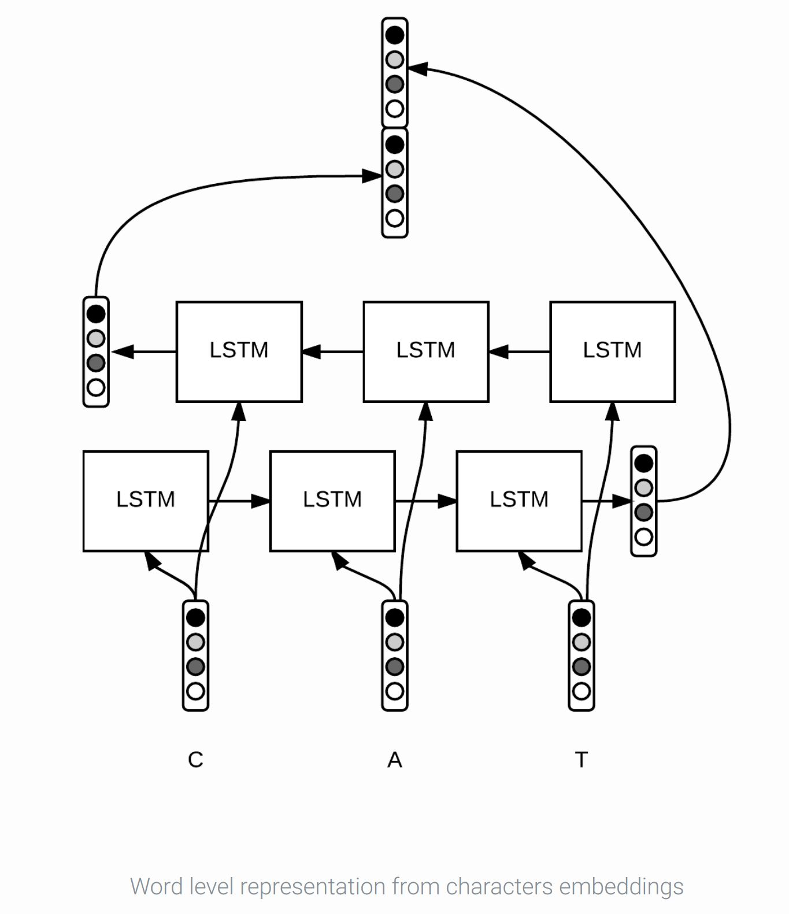
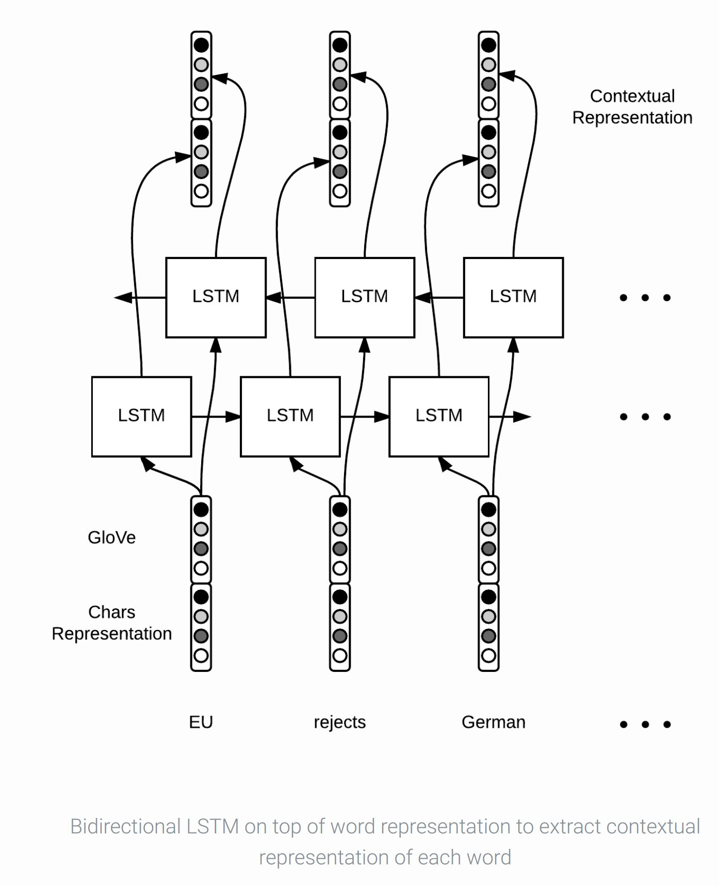
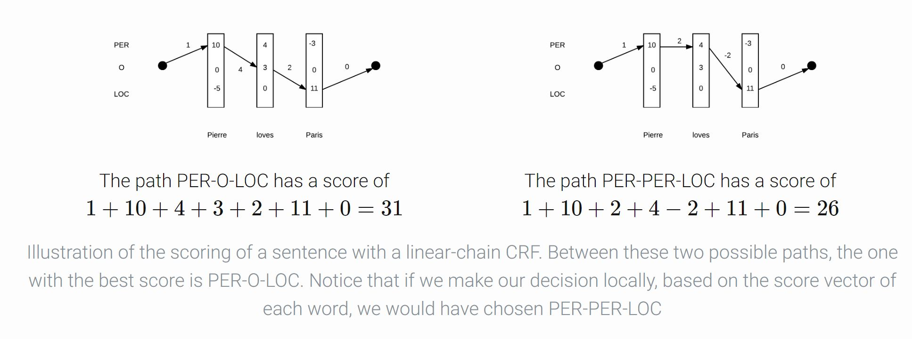

# Bidirectional LSTM-CRF models for Sequence Tagging

This repo is based on the following paper and Github implementation:

*   Zhiheng Huangm • Wei Xu • Kai Yu • *Bidirectional LSTM-CRF models for Sequence Tagging.* ACL 2015. 
 [pdf](https://arxiv.org/pdf/1508.01991).
*   https://github.com/guillaumegenthial/tf_ner/tree/master/models/lstm_crf
*   https://github.com/sarveshsparab/BiLSTMCRFSeqTag

## Prerequisite
- tensorflow>=1.9
- numpy >=1.13.3
  - Find specific machine TensorFlow version from the follwoing link
    - https://chromium.googlesource.com/external/github.com/tensorflow/tensorflow/+/r0.12/tensorflow/g3doc/get_started/os_setup.md

## Input/Output format for prediction

**Input:**

- text file containing sentence in following format:
  
  - \<word\>  \<POS\>   \<Chung tag\>   \<NER tag\>
  
  - Sample Input
  
    ```
    JAPAN   NNP     B-NP    B-LOC
    GET     VB      B-VP    O
    LUCKY   NNP     B-NP    O
    WIN     NNP     I-NP    O
    ```

**Output**:

- \<word\>  \<ground_truth\>    \<predicted_output\>

- Sample Output

- ```
    JAPAN   B-LOC   B-LOC
    GET     O       O
    LUCKY   O       O
    WIN     O       O
  ```

## Input format for training

- For Training purpose it requires the following files:
  - train/test/dev dataset in input files
  - glove.840B.300d.txt
- To run on full train data download files from this two links:
  - http://nlp.stanford.edu/data/glove.840B.300d.zip

## Architecture

1. [GloVe 840B vectors](https://nlp.stanford.edu/projects/glove/)
2. Chars embeddings
3. Chars 1d convolution and max-pooling
4. Bi-LSTM
5. CRF

## Approach

- Tokenize the inputs and build their Glove representations
- Perform training in batches, firstly run the BiLSTM-CRF model in forward pass for both the forward and backward state of the network and capture score for all tags at all positions
 -Run CRF layer forward and backward pass and calculate the Viterbi score/sequence to find high probability candidate tags and back propagate the errors and update the network parameters








## Benchmark datasets

- [CoNLL 2003](https://www.clips.uantwerpen.be/conll2003/ner/)

## Evaluation metrics and results

|| `train` | `testa` | `testb` | Paper, `testb` |
|---|:---:|:---:|:---:|:---:|
|best| 99.16 | 94.53 | __91.18__ | 91.21 |
|best (EMA) |99.44 | 94.50 | 91.17 | |
|mean ± std | 98.86 ± 0.30| 94.10 ± 0.26| __91.20__ ± 0.15 |  |
|mean ± std (EMA) | 98.67 ± 0.39| 94.29 ± 0.17| 91.13 ± 0.11 |  |
|abs. best |  | | 91.42 |  |
|abs. best (EMA) |   | | 91.22 |  |

## Jupyter Notebook

[BiLSTMCRFSeqTag.ipynb](./notebook/BiLSTMCRFSeqTag.ipynb)

## YouTube Video

[https://youtu.be/JnZnLbpMo-A](https://youtu.be/JnZnLbpMo-A)


 ## To Run

 1. Import the Module from main.py

        ```python
        from model.main import BiLSTMCRFSeqTag
        ```
    
 2. Create Instance of the module

        ```python
        blcst = BiLSTMCRFSeqTag()
        ```

 3. First call read_dataset() and give all the files required to train in the given order
   - file_dict
   - dataset_name
   *Refer [notebook](./notebook/BiLSTMCRFSeqTag.ipynb) for details on additional parameters*

        ```python
        file_dict = dict()
        file_dict['train'] = './data/sample/ner_test_input.txt'
        file_dict['test'] = './data/sample/ner_test_input.txt'
        file_dict['dev'] = './data/sample/ner_test_input.txt'
        
        data = blcst.read_dataset( file_dict, "CoNLL03" )
        ```

 4. To train run the following commands. If already trained you can skip this.
    Parameters needed in order
    - data
    *Refer [notebook](./notebook/BiLSTMCRFSeqTag.ipynb) for details on additional parameters*
    
        ```python
        blcst.train(data)
        ```

 5. To predict on any sentence give path to file.
    Parameters needed in order
    - Test file path
    *Refer [notebook](./notebook/BiLSTMCRFSeqTag.ipynb) for details on additional parameters*

    And each line should contain text in following format:
    - **\<word\>  \<POS\>   \<Chung tag\>   \<NER tag\>**
    - Sample file in the correct format can be found [here](data/sample/ner_test_input.txt)

        ```python
        predictions = blcst.predict(test_file_path)
        print(predictions)
        ```

 6. Evaluate on provided dataset in the predict
    Parameters needed in order
    - predictions
    - groundTruths
    - **Note**: In this case ground_truth must be present, or can be generated with the *convert_ground_truth* method 

      ```python
       precision, recall, f1_score = blcst.evaluate(predictions, groundTruths)
       print("precision: {}\trecall: {}\tf1: {}".format(precision, recall, f1_score))
      ```

## To Test
Custom test-case added to ensure proper working of the code

To use the input file, output file and test python file in folder [test](./test) to test
 